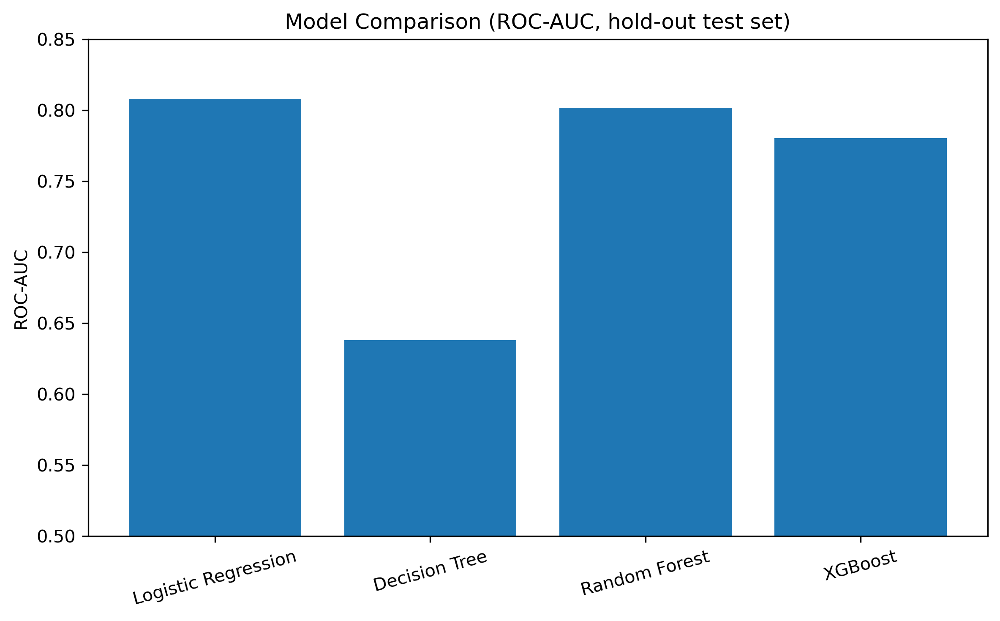
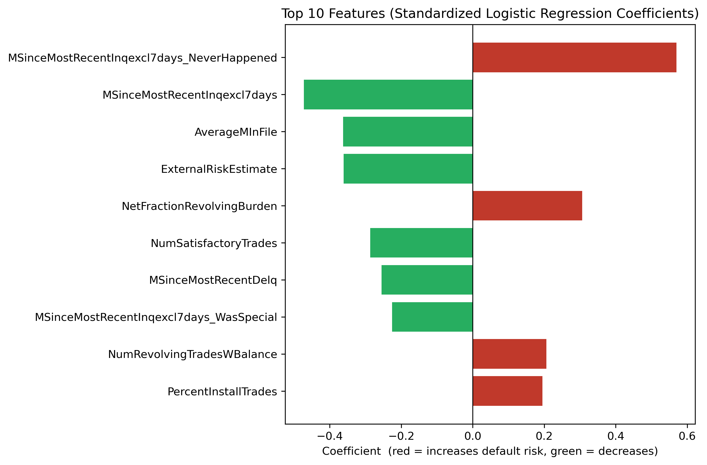
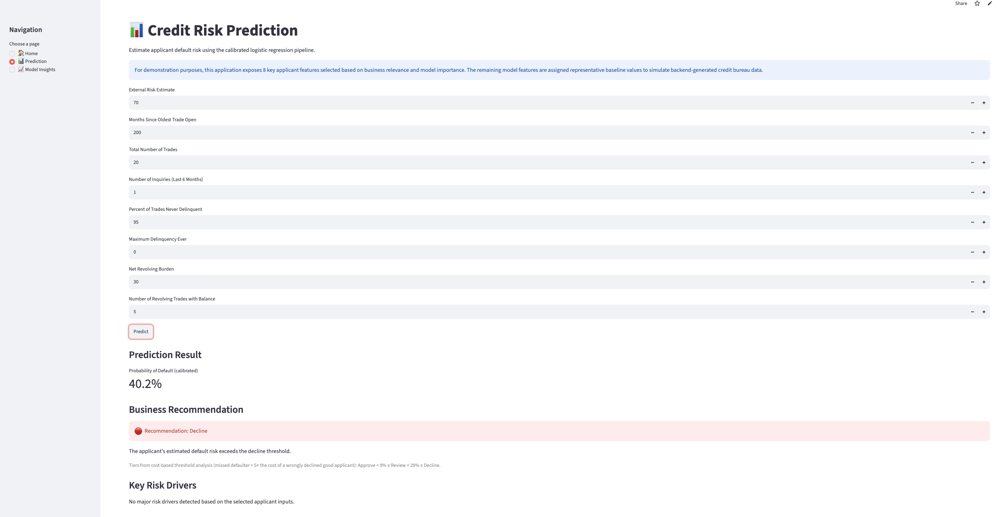

# 🏦 HELOC Credit Risk Decision Support System


An end-to-end machine learning decision support system for Home Equity Line of Credit (HELOC) risk assessment.

🔗 **Live Demo:** https://jean-heloc-credit-risk.streamlit.app/

This project is designed as a **decision-support system rather than a fully automated approval engine**: the model provides calibrated default probabilities and Approve / Review / Decline recommendation tiers to assist human underwriters, and ambiguous cases are explicitly routed to manual review.

---

## Application Demo


---

## Data Source

The data comes from the **FICO Explainable Machine Learning (xML) Challenge** HELOC dataset: ~10,000 anonymized HELOC applications described by 23 credit-bureau features, with a binary target indicating whether the applicant was ever 90+ days past due within 24 months.

Per the FICO data usage license, the raw data is **not redistributed in this repository**. Request access via the FICO Community xML Challenge page, then place `heloc_dataset_v1.xlsx` under `data/`.

A key preprocessing challenge — and a differentiator of this project — is the dataset's three special codes, which are handled according to their business meaning rather than blanket-imputed:

| Code | Meaning | Treatment |
|------|---------|-----------|
| -9 | No bureau record | Rows that are entirely -9 are dropped; otherwise flagged + imputed |
| -8 | No usable values | Indicator flag + median imputation |
| -7 | Condition not met (e.g. *never* delinquent — a low-risk signal) | Indicator flag + filled with training-set maximum |

---

## Model Performance

Four classifiers were compared on both a stratified hold-out test set and 5-fold cross-validation (positive class = default):

| Model | Test ROC-AUC | CV ROC-AUC (mean ± std) | Test Recall |
|---|---|---|---|
| **Logistic Regression** ✅ | **0.808** | **0.8041 ± 0.0094** | 0.765 |
| XGBoost (tuned) | 0.805 | 0.8033 | 0.769 |
| Random Forest | 0.802 | 0.7911 ± 0.0125 | 0.771 |
| XGBoost (default) | 0.780 | 0.7786 ± 0.0074 | 0.759 |
| Decision Tree | 0.638 | 0.6292 ± 0.0102 | 0.659 |

**Why Logistic Regression?** Even a fully tuned gradient-boosting model could not outperform it (0.8033 vs 0.8041 CV ROC-AUC — well within one standard deviation), so selecting the intrinsically interpretable model costs nothing in accuracy. Its standardized coefficients provide transparent, regulator-friendly explanations for every decision — no post-hoc approximation needed. This matters in credit decisioning, where adverse-action reasoning must be defensible. (SHAP analysis of the tree ensembles is planned as future work for comparison.)

Published benchmarks on the FICO HELOC dataset generally top out around ROC-AUC 0.79–0.80, so these results sit at the practical ceiling for this data.




### Key Results

- ✔️ Business-aware preprocessing of FICO special values (indicator flags + semantic fills), packaged in a custom sklearn transformer.
- ✔️ Entire preprocessing-to-prediction chain saved as **one pipeline**, shared verbatim between training and the deployed app — no train/serve skew.
- ✔️ Logistic Regression selected via hold-out **and** cross-validated comparison against tuned XGBoost.
- ✔️ Probabilities **isotonically calibrated**, so the displayed probability of default is meaningful.
- ✔️ Decision thresholds derived from an explicit **cost analysis**, not the arbitrary 0.5 default.

---

## From Probability to Decision

Under an illustrative cost assumption (a missed defaulter costs 5× a wrongly declined good applicant), the cost-optimal threshold is **0.19**. Because the cost curve is flat near its minimum, a band around it defines a three-tier policy:

| Recommendation | Rule | Share of test set | Observed default rate |
|---|---|---|---|
| ✅ Approve | P(default) < 0.09 | 5.4% | **8.4%** |
| 🟡 Review (human underwriter) | 0.09 – 0.29 | 20.5% | 19.8% |
| 🔴 Decline | ≥ 0.29 | 74.1% | **64.1%** |

The Approve tier's 8.4% default rate versus the dataset's ~52% base rate is a six-fold risk reduction; the Review tier isolates exactly the ambiguous cases where human judgment adds the most value.

> **Note on tier shares:** this research dataset has an unusually high base default rate (~52%). A real applicant population has a far lower base rate, and the same calibrated model would route a much larger share to Approve. Production thresholds would be derived from the lender's actual loss-given-default and margin data.

---

## Interactive Prediction

Users can estimate an applicant's probability of default by entering key credit characteristics. The application provides:

- Calibrated probability of default
- Approve / Review / Decline recommendation with the cost-based thresholds
- Key business risk drivers for the entered profile

Note: `ExternalRiskEstimate` works like a credit score — **higher is better** — despite the name.



---

## Workflow

```
Raw HELOC Data
      |
      v
Drop No-Bureau-Record Rows · Encode Target (default = 1) · Stratified Split
      |
      v
Pipeline: SpecialValueTransformer -> Median Imputation -> Standardization -> Logistic Regression
      |
      v
Model Selection (hold-out + 5-fold CV vs Decision Tree / Random Forest / tuned XGBoost)
      |
      v
Isotonic Calibration -> Cost-Based Thresholds -> Approve / Review / Decline Tiers
      |
      v
Single Saved Pipeline -> Streamlit Decision-Support App
```

---

## Tech Stack

**Languages & Libraries:** Python · pandas · scikit-learn · XGBoost · Streamlit · Matplotlib · Joblib

<details>
<summary><b>Run Locally</b></summary>

```bash
# Install dependencies
pip install -r requirements.txt

# Place the FICO dataset (see Data Source) at data/heloc_dataset_v1.xlsx

# Launch the app from the repo root
streamlit run app/streamlit_app.py
```
</details>

<details>
<summary><b>Project Structure</b></summary>

```
├── app/
│   └── streamlit_app.py        # Decision-support application
├── data/                       # FICO dataset (not tracked; see Data Source)
├── images/                     # Figures generated by the notebook
├── models/
│   └── heloc_pipeline.pkl      # Calibrated end-to-end pipeline + tier thresholds
├── notebooks/
│   └── HELOC_Credit_Risk_Decision_Support.ipynb
├── src/
│   └── preprocessing.py        # Shared special-value transformer (train + serve)
├── requirements.txt
└── README.md
```
</details>

---

## Limitations & Future Work

- The 5:1 cost ratio is illustrative; production thresholds require actual loss-given-default and margin data.
- SHAP-based interpretation of the tuned XGBoost model for a direct interpretability comparison.
- Fairness auditing across applicant segments (the public dataset contains no protected attributes).
- Data-drift monitoring between bureau snapshots for production use.

## License

MIT
